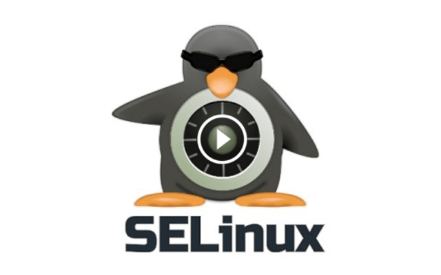

# Trabajando con SELinux
SELinux (Security-Enhanced Linux) es un mecanismo de seguridad, que se implementa directamente en el Kernel basado en MAC.

[Implementar SELinux](https://github.com/MoralG/Trabajando_con_SELinux/blob/master/Trabajando_con_SELinux.md#trabajando-con-selinux)

Vamos a habilitar SELinux, creando las políticas necesarias de manera estricta y segura. Vamos a utilizar el servidor Salmorejo que es CentOS.

